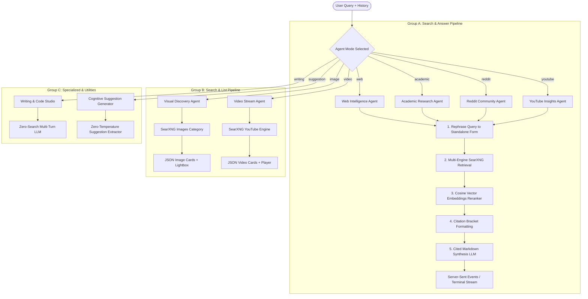

# 🧠 NexusAI Agent Architecture & LCEL Blueprint

This document details the internal architecture, mathematical formulations, and LangChain Expression Language (LCEL) design patterns used across all **8 specialized agents** in NexusAI.

---

## 1. System Topology & Data Flow

---

## 2. Core LangChain LCEL Primitives

Every agent in NexusAI is built using LangChain's pipeline composition primitives:

| LCEL Primitive | Purpose in NexusAI |
|---|---|
| `RunnableSequence` | Sequential top-to-bottom pipeline execution (`chain.pipe()`). |
| `RunnableMap` | Parallel preparation of input variables (`query`, `chat_history`, `context`). |
| `RunnableLambda` | Wrapping custom async operations (SearXNG API calls, cosine reranker). |
| `ChatPromptTemplate` | Multi-turn prompt construction with `MessagesPlaceholder("chat_history")`. |
| `StringOutputParser` | Clean string parsing from LLM message tokens. |
| `.withConfig({ runName })` | Tagging steps (`"FinalSourceRetriever"`, `"FinalResponseGenerator"`) for granular event interception. |

---

## 3. Mathematical Vector Reranking

NexusAI uses exact mathematical **Cosine Similarity** to compare the user's query vector $\vec{u}$ with document embedding vectors $\vec{v}_i$:

$$\text{Cosine Similarity}(\vec{u}, \vec{v}_i) = \frac{\vec{u} \cdot \vec{v}_i}{\|\vec{u}\|_2 \|\vec{v}_i\|_2} = \frac{\sum_{j=1}^{d} u_j v_{i,j}}{\sqrt{\sum_{j=1}^{d} u_j^2} \sqrt{\sum_{j=1}^{d} v_{i,j}^2}}$$

### Reranking Algorithm:
1. **Query Embedding**: $\vec{u} = \text{Embed}(\text{query})$
2. **Document Embeddings**: $\vec{v}_i = \text{Embed}(\text{doc}_i)$
3. **Score Matrix**: $S_i = \text{CosineSimilarity}(\vec{u}, \vec{v}_i)$
4. **Threshold Filtering**: Keep documents where $S_i \ge 0.45$, sorted descending.
5. **Top-K Cutoff**: Select the top 8–12 most relevant documents to form the context window.

---

## 4. The 8 Agents Detailed

### 1. Web Intelligence Agent (`webAgent.ts`)
- **Focus**: Global real-time web retrieval.
- **Engines**: `google`, `bing`, `duckduckgo`.
- **Persona**: Objective, comprehensive, cited synthesizer.

### 2. Academic Research Agent (`academicAgent.ts`)
- **Focus**: Peer-reviewed scientific literature and preprints.
- **Engines**: `arxiv`, `google scholar`, `pubmed`, `internetarchivescholar`.
- **Persona**: Formal scholarly researcher emphasizing methodologies, sample sizes, and empirical findings.

### 3. Reddit & Community Agent (`redditAgent.ts`)
- **Focus**: Public discussions, crowd sentiment, and authentic field experience.
- **Engines**: `reddit`.
- **Persona**: Community analyst breaking down consensus, common gotchas, and contrarian perspectives.

### 4. YouTube Insights Agent (`youtubeAgent.ts`)
- **Focus**: Video tutorials, lectures, creator breakdowns, and podcasts.
- **Engines**: `youtube`.
- **Persona**: Video learning assistant organizing key takeaways, timestamps, and channel citations.

### 5. Visual Discovery Agent (`imageAgent.ts`)
- **Focus**: Image assets and infographics.
- **Engines**: `bing images`, `google images` with category `images`.
- **Output**: JSON image array `{ img_src, thumbnail, url, title, score }` for interactive lightbox.

### 6. Video Stream Agent (`videoAgent.ts`)
- **Focus**: Streamable video URLs and embed players.
- **Engines**: `youtube`.
- **Output**: JSON video array `{ url, iframe_src, thumbnail, title }` with auto YouTube embed converter.

### 7. Writing & Code Studio (`writingAgent.ts`)
- **Focus**: Zero-search creative writing, code architecture, copy editing, and summarization.
- **Engines**: None (direct LLM generation).
- **Persona**: Senior technical writer & software architect.

### 8. Cognitive Suggestion Generator (`suggestionAgent.ts`)
- **Focus**: Context-aware follow-up question generation.
- **Temperature**: `0.0` for deterministic logical variety.
- **Parser**: `ListLineOutputParser` extracting 4–5 concise inquiry chips.
